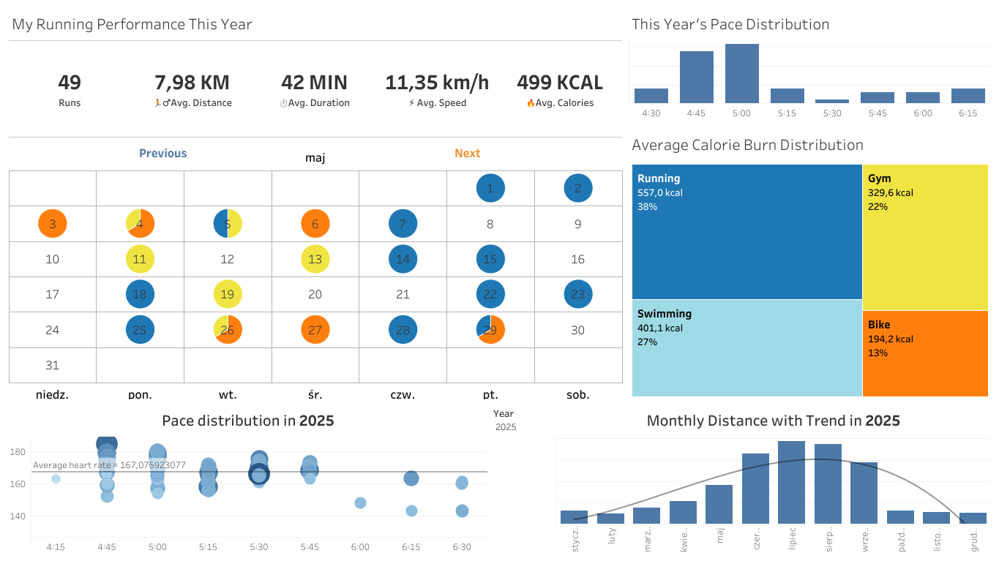

# 🏃 Running Performance Dashboard

An interactive Power BI dashboard for analyzing personal sports activity with a focus on running performance. The dashboard provides insights into training habits, pace distribution, calorie expenditure, and monthly progress.

## 🚀 Features

- 🏃 Running performance summary
  - Total runs
  - Average distance
  - Average duration
  - Average speed
  - Average calories burned
- ⏱ Pace distribution analysis
- 📅 Calendar view of training sessions
- 🔥 Calorie burn by activity type
- 📈 Monthly distance with trend analysis
- ❤️ Heart rate vs. running pace visualization
- 📆 Year filtering for historical comparisons

## 📊 Dashboard Preview
The screenshot below presents the completed dashboard, highlighting the main KPIs, visualizations, and insights extracted from Strava data.


## 📂 Repository Structure

```
/tableau-strava-tracker-dashboard
    ├── /dashboards
    │   └── strava_tracker.twbx
    ├── /data
    │   ├── strava.csv
    │   └── date.csv
    ├── /images
    │   └── dashboard_strava_tracker.png
    └── README.md
```

## 📈 Purpose

This project was created to practice:

- Power BI dashboard design
- Data modeling
- DAX calculations
- Interactive reporting
- Data visualization best practices

To make the project more practical, I decided to build it using my own running data exported from Strava. Rather than analyzing a generic dataset, I wanted to create a dashboard that I could genuinely use to track my progress, monitor training trends, and better understand my performance over time. This project is both a portfolio piece and a personal tool that I intend to expand with additional analyses and features in the future.

